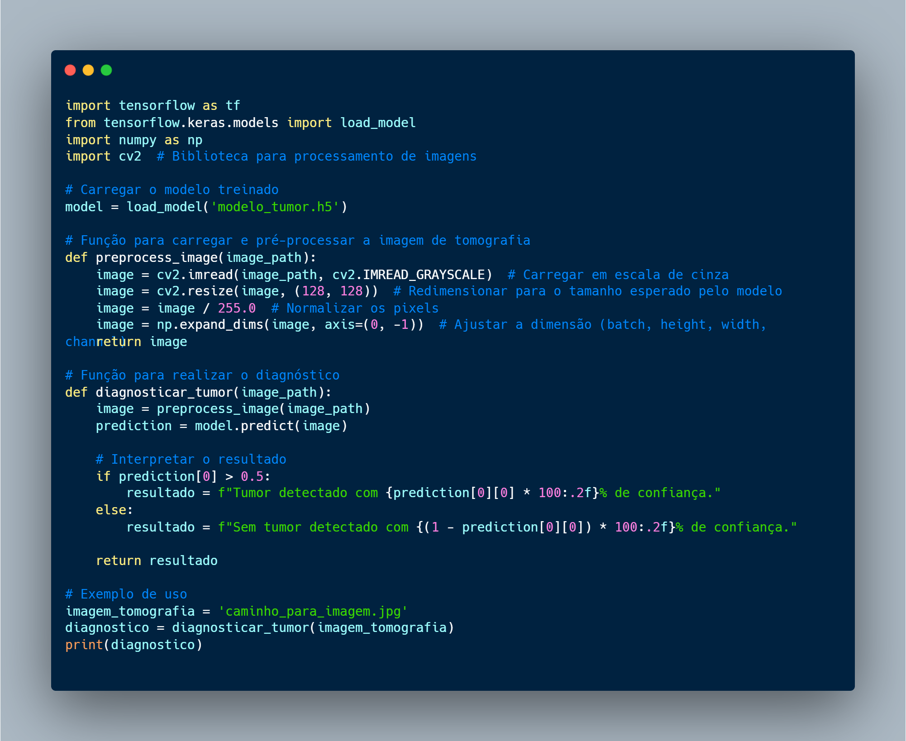

# Inteligência Artificial em Aspectos Gerais e uma Visão Macro sobre Agentes Inteligentes

---

**Autor:** Wildemberg Sales da Silva Junior

**Matrícula:** 202017503

**Data:** 19/11/2024

**Instituição/Universidade:** Universidade de Brasília(UnB)

**Disciplina:** Inteligência Artificial - FGA0221

---

## Resumo

Este artigo oferece uma visão abrangente sobre a Inteligência Artificial (IA), abordando sua origem, os fundamentos que definem o modelo padrão, as características essenciais para a definição de inteligência e IA, além da concepção de agentes inteligentes. Foram explorados os modelos e conceitos clássicos do pensamento, com o objetivo de compreender como as IAs devem agir, investigando as características do pensamento humano e racional. Aprofundamos a análise para definir o que são agentes inteligentes, suas principais características e seu papel dentro dos ambientes em que atuam, destacando como as propriedades do ambiente podem influenciar o comportamento de um agente. Por fim, discutimos alguns dos tipos de agentes existentes, suas atuações e aplicações.

## Introdução

A capacidade humana de evolução sempre foi alta, e agora com a era da inteligência artificial (IA), essa capacidade tende a ser mais alta ainda, transformando sonhos em realidade, ideias em produtos, e tarefas que demorariam anos para serem realizadas, em tarefas de minutos. 

Um fator importante quando falamos do mundo atual e do uso da IA, é que modelos de IA já existem a muito mais tempo do que parece, isso se pensarmos que o primeiro modelo de IA foi o modelo de neurônios criado por Warren McCulloch e Walter Pitts em 1943. Entretanto, o uso de modelos de Large Language Model(LLM) se popularizou de uma forma exponencial nos últimos anos, e devido a isso, profissionais de diversas áreas começaram a ter o prazer e o poder dessas ferramentas, tornando o uso da IA mais comum no cotidiano.

Nos dias de hoje o entendimento sobre o que é IA e suas ramificações é um fator importante e diferencial para diversas áreas, suas aplicações na forma correta podem mudar o rumo de diversos setores, entender sua origem cria bases sólidas e geram oportunidades de novas pesquisas e entendimentos sobre suas aplicações, além de que entender seus limites, riscos e benefícios proporciona um entendimento profundo sobre como usar suas ferramentas e agregar valor nas utilizações do dia a dia.

Neste artigo abordaremos uma visão geral do que é a Inteligência Artifical, desde sua origem, como a definimos, suas utilizações no cenário atual, e seu impacto no mundo, trazendo diversos exemplos reais do seu uso, e também visões abstratas dos assuntos para um melhor entendimento da informação.

## Fundamentos da Inteligência e da IA

### O que é Inteligência?

Antes de entender o que é inteligência artificial, devemos entender o fundamento do que é a inteligência.  

Durante anos diversos autores tentam definir o que é inteligência, muitos relacionam com o ato de escolher o melhor, seja caminho ou outro tipo de escolha, outros relacionam com o ato de raciocinar sobre assuntos e compreender eles, alguns ligam a ideia de inteligência a capacidade de aprender e ou se adaptar. Se observamos as definições propostas, vemos que muitas fazem sentidos, e que muitas são realmente a definição do que é a inteligência, pois inteligência é algo muito abstrato para ter somente uma definição. Se buscarmos um pouco mais a fundo o significado de inteligência e trouxermos sua etimologia para o nosso estudo, vemos que a palavra inteligência vem do latim _intellectus_ de _intelligere_ que significa inteligir, entender, compreender. Se compararmos a definição da palavra vinda do latim, com algumas ideias propostas por autores, vemos que todas as definições realmente se encaixam.  

Proponho que você leitor também pense um pouco mais sobre esse assunto e que tente definir o que é a inteligência para si, esta abordagem pode te trazer um asptecto mais profundo de entendimento do que iremos discutir a seguir.

### O que é a Inteligência Artificial?

Agora que temos uma visão mais ampla do que é a inteligência, como podemos definir o que é IA?

Para responder essa pergunta, podemos ver algumas das definições impostas por grandes nomes do setor tecnológico:

> Inteligência artificial, ou IA, é uma tecnologia que permite que computadores e máquinas simulem a capacidade de resolução de problemas e a inteligência humana. - (IBM)

> O campo da inteligência artificial procura não apenas entender, mas também construir entidades inteligentes – máquinas que pode calcular como agir de forma eficaz e segura em uma ampla variedade de novas situações. - (Russell e Norving).

> A inteligência artificial limitada, por vezes denominada "IA fraca", refere-se à capacidade de um sistema informático efetuar uma tarefa de âmbito limitado melhor do que um ser humano. A inteligência artificial geral, por vezes denominada "IA forte" ou "IA de nível humano", refere-se à capacidade de um sistema informático de superar os humanos em tarefas intelectuais. É o tipo de IA que se vê nos filmes em que os robots desenvolvem pensamentos conscientes e agem de acordo com motivações próprias. - (Microsoft)

A partir das frases acima, pode-se notar que muitas vezes a IA é relacionada com o pensar humano, vemos até uma comparação com o filme "I, Robot" 2004, que mostra a evolução do mundo e o desenvolvimento de modelos de IA para servir os humanos, e quando uma IA se torna realmente capaz de pensar e opinar sobre diversos aspectos, ela começa a parecer uma ameaça.  

Mas então entra a pergunta, supondo que o foco da evolução das IA's seja ter uma "inteligência" humana, o acontecimento disso seria bom ou ruim? O fato dela poder decidir sozinha sem interferência humana, o ato de pensar e raciocinar, traria benefícios ou malefícios ao ser humano? São questões a se pensar veja bem, o fator de poder perder o controle sobre elas pode trazer malefícios para a humanidade, mas em contra partida, o ato de pensar sozinha e tomar decisões sozinhas pode resolver grandes problemas atuais e futuros, mas de qualquer forma, são perguntas que podem mudar suas opiniões sobre o uso da IA e devem ser pensadas com calma.  

Voltando ao tópico do assunto que engloba uma definição para o que é inteligência artificial, podemos considerar que é o ato de uma máquina conseguir um nível de "inteligência" similar a de um humano, com a capacidade de raciocinar, calcular, aprender, e decidir sobre as escolhes impostas.

### Origem da IA

Uma das grandes perguntas que vários estudantes iniciantes fazem é: "Quem inventou a IA?". Para saber sobre a origem da IA é importante ter em mente que não foi uma pessoa específica, ou uma só teoria que gerou a IA, e sim um conjunto de pesquisas e pesquisadores que ao longo do tempo formularam diversos experimentos e teorias sobre esse assunto formando a IA como ela é hoje.  

Podemos trazer aqui duas das principais pesquisas que iniciaram as grandes pesquisas relacionadas a IA, dentre essas duas estão o Teste de Turing, criado por Alan Turing, que era voltada a um teste em que uma máquina tinha que se passar por um humano em uma conversa escrita com uma pessoa real, caso a pessoa que estivesse conversando com a máquina não conseguisse diferenciar ela de uma pessoa real, a máquina ganhava o teste. Outra grande pesquisa que influenciou os estudos na área de IA foi o Modelo de Neurônios de Warren McCulloch e Walter Pitts (1943), onde esse modelo trazia a ideia de que cada neurônio poderia ser caracterizado como "ligado" ou "desligado", e que o neurônio passa do estado "desligado" para o "ligado" após um grande estimulo de neurônios vizinhos, trazendo um aspecto em que as redes de estivessem adequadamente definidas, poderiam ter a capacidade de aprender.  

Algo importante que deve ser ressaltado é que para o entendimento que temos hoje em dia sobre IA, diversas áreas se juntaram a pesquisa para poder trazer diferentes visões em aspectos matemáticos e de mundo real, algumas das áreas que impulsionaram o desenvolvimento da IA são: Filosofia, Matemática, Economia, Neurociência, Psicologia, Engenharia da computação, Teoria de controle e Cibernética, Linguística, dentre várias outras.

## Modelos e Conceitos Clássicos

Quando pensamos no processo de como uma IA deve agir, devemos entender como ela pensa e age de acordo com as situações em que é exposta, com isso, nesse tópico abordarems dois modelos importantes para entender a modelagem do pensamento das IA's.

### Pensando de Forma Humana (Modelagem Cognitiva)

Para o pensamento de forma humana, podemos entender ele como a visão de diferentes execuções de ações com um mesmo objetivo, mas não somente com o foco de resolver o problema, e sim com uma visão de comparar as sequências, o tempo e as ações executadas com as dos humanos, com o foco de descobrir o melhor jeito para ser feito.  
Se pegarmos uma ideia do que é o modelo cognitivo conseguimos separar em quatro etapas sequenciais: Situação, Pensamento, Emoção, Execução.  

* Situação: Quando a problemática é apresentado a IA;
* Pensamento: Quando a situação é interpretada;
* Emoção: Quando uma interpretação mais aprofundada resultada de um pensamento, como uma emoção;
* Execução: Uma ação em resposta a emoção;

### Pensando Racionalmente ("Leis do Pensamento")

O pensamento racional tem um aspecto diferente do pensamento de forma humana que se focava na emoção para executar algo, o pensamento racional se foca na lógica, no silogismo, e na probabilidade de resultados. Este tipo de pensamento gera um modelo mais racional para uma IA, trazendo um aspecto de conseguir raciocinar e prever baseado nos dados, mas em contra partida, ela não gera em si um comportamento inteligente, pois não leva em consideração aspectos fora dos dados como a própria "emoção".

### Agente Racional

Um agente é algo que age sobre um ambiente, com isso para um agente ser inteligente é esperado que ele cumpra alguns critérios, onde tais critérios são:

* opere de forma autônoma,
* perceba seu ambiente, 
* persista por um período de tempo prolongado, 
* adapte-se a mudanças 
* crie e busque objetivos

Quando um agente cumpre esses requisitos ele é considerado um agente inteligente, para deixar mais claro essa ideia podemos pegar dois exemplos, o primeiro de um ser humano agindo em um ambiente, e o segundo o exemplo de uma IA agindo sobre um ambiente:

* **Exemplo**: 
    
    > Um homem chega a uma cafeteria com o objetivo de comprar um copo de café, ao chegar no local ele olha ao redor e encontra a fila do balcão, ele se desloca a ela e entra ao final da fila, ele começa a perceber que a fila não está diminuindo de maneira flúida e que está muito grande para esperar, ao olhar ao seu redor novamente e vê que no outro lado da rua existe uma caferetira que parece estar menos cheia e com uma fila menor, com isso ele se desloca para a outra cafeteria para ser atendido com mais agilidade fazendo com que ele alcance o seu objetivo de forma mais rápida.

* **Exemplo**:

    > Um carro autônomo tem o objetivo de se deslocar de um ponto A a um ponto B, ele possui 3 rotas que pode utilizar, e foi programado para seguir a rota mais rápida pois seus passageiros costumam ter pressa para se deslocar, ao analisar as rotas possíveis ele identifica que a rota mais rápida é a número 2, a partir disso ele começa a viagem, no meio do caminho ele recebe um sinal em seu GPS que houve um acidente e que a rota número 2 está interditada acrescentando um longo tempo de espera aos carros que queiram utilizá-la, com isso o carro executa uma nova verificação para identificar o novo caminho a ser percorrido, em sua verificação ele identifica que a rota 3 parece uma boa opção mesmo sendo a mais longa dentre às 3 rotas, ele se desloca para a via da rota 3 e continua seguindo o seu caminho, após alguns quilômetros, ele chega a seu destino no ponto B. Mesmo não que ele não tenha conseguido percorrer o caminho da rota 2 que possuía o menor tempo, ele conseguiu se adaptar a mudança repentina e conseguiu chegar ao objetivo no menor tempo calculado, mesmo que isso tenha feito ele rodar mais quilômetros.

### Modelo Padrão

Existe uma abordagem para as IA's que prevalece na maior parte da história nesse campo de conhecimento, que é a abordagem racional, com isso as IA's se concentravam no estudo e contrução de agentes que fazer a "coisa certa", sendo que a "coisa certa" é a que definimos para ela como objetivo, como no exemplo anterior que o carro autônomo tinha o objetivo de chegar ao ponto B no menor tempo possível. Por ser tão difundido e ter prevalecido como padrão pela maior parte do tempo na história, ele foi considerado o modelo padrão.

Este modelo padrão tem problemas relacionados a sua utilização a longo prazo, a priori temos que o modelo esse segue somente o padrão que especificamos para ele, e no mundo real, o objetivo nem sempre consegue ser especificado da melhor forma, com isso introduzindo falhas no modelo. Esse problema que engloba as questões dos objetivos programados com o alinhamento dos objetivos reais é conhecido como "Problema de Alinhamento de Valor". 

Se pegarmos o exemplo 2 e pensarmos no objetivo do carro que era chegar ao ponto B pela rota com o menor tempo para satisfazer o desejo do usuário que era o deslocamento rápido, mas o usuário também deseja que o caminho para o ponto B seja uma rota mais segura, a IA pode não validar esse desejo pois sua programação segue o objetivo da rota mais rápida e por consequência, a rota mais rápida é a menos segura. 

## Aplicações Atuais de IA

Antes de vermos onde nos dias atuais existem as aplicações de IA, devemos entender primeiramente o que são sistemas especialistas e sua importância.  

Sistemas especialistas são modelos de IA especializado em tarefas e domínios específicos, ou seja, ele é treinado para resolver problemas específicos. Grandes empresas se utilizam de sistemas deste modelo para otimizar processos ou personalizar suas ferramentas. A seguir vamos ver alguns exemplos de forma detalhada:

* **Exemplo**:

    > Um modelo que analisa os dados de clientes da empresa e verifica as tendências de vendas baseado em períodos específicos do ano. Este modelo costuma ser muito utilizado em empresas que mudam seus produtos de acordo com os meses do ano ou novas tendências que surgem. Um modelo de IA para auxiliar analistas de dados é muito importante, principalmente quando a base de dados é extremamente extensa.

* **Exemplo**:
    
    > Um modelo que atua em tempo real no mercado de ações, analisando as altas e baixas do mercado e fazendo transações de forma automática para eliminar a necessidade de um analista verificando dados o tempo todo. Esse tipo de automação se tornou bastante popular nos últimos anos, especialistas em ações confiaram seus investimentos nas IA's, e em muitos casos eles conseguiram dobrar suas ações.

* **Exemplo**:

    > Um modelo que analisa imagens de tomografias e identificam anomalias para descobrir ou prever tumores cerebrais. Não é algo muito popularizado ainda aqui no Brasil, mas sua utilização pode dar um feedback a mais ao especialista que está analisando os pacientes.

* **Exemplo**:

    > Um modelo que analisa imagens de folhas de plantas e identifica a doença que está presente na imagem, ou um drone acoplado com uma câmera que identifica focos de pragas dentro de plantações em tempo real. Esses tipos de modelos ainda não são muito populares dentro do agronegócio pelo custo de sua implantação, mas grandes plantadores já utilizam essas ferramentas para melhorar o cuidado com suas plantações.

* **Exemplo**:

    > Modelos que ajudam sistemas de e-commerce a fornecerem produtos de acordo com o interesse dos usuários, e baseados em seus dados de visitas e pesquisas em outros sites. Esses modelos são amplamentes usados nos dias atuais, dentre algumas empresas que se utilizam desses modelos temos a Amazon, Mercado Livre, Walmart, e várias outras grandes marcas.

### Riscos e Benefícios da IA

Após entender o que são IA's e algumas de suas aplicações presentes no nosso cotidiano, devemos começar a pensar sobre quais seus riscos e benefícios para a humanidade. Até o momento vimos que a utilização de IA's pode ajudar diversos setores, mas a observação dos seus riscos para a humanidade é um fator crucial para entender completamente a capacidade que IA's possuem.

Vimos anteriormente nos exemplos do tópico passado que a IA pode ser utilizada na identificação de doenças no setor médico, pode ajudar os agricultores no cultivo de suas plantações, também serve análise de dados em larga escala de grandes empresas.

Dentro desses exemplos podemos citar os seus riscos também, no caso do setor médico, temos a falsa identificação de problemas ou falta desta identificação, os dois sendo riscos perigosos para essa área, no caso do sistema de auxílio para os agricultores temos o risco da falsa identificação de doenças ou a identificação errada, que pode induzir o agricultor a fornecer um tratamento errado para a plantação, afetando o plantio, agora indo para o caso das análises de grandes dados em empresas, e um mal tratamento dos dados pela IA pode afetar todo o planejamento da empresa causando uma problemática nas vendas e na produção de produtos.

Riscos e benefícios não faltam quando se trata do uso de IA's, mas muitas de suas utilizações devem ser moderadas pelo próprio usuário para evitar gerarem problemáticas no mundo real. 

Trazendo essa visão do uso em mundo real, algumas IA's podem ser criadas especificamente para prejudicar a humanidade, desde seu uso em guerras, até a criação de armas biológicas, por isso, alguns limites devem ser impostos desde a criação das IA's para que elas não possam prejudicar a humanidade de alguma forma. No Brasil temos a lei 759/23 que regulamenta o uso da IA.

## Ambientes

Como já foi conversado anteriormente agentes são algo que agem sobre o ambiente, um agente para ser inteligente ele deve cumprir alguns requisitos, tais requisitos já foram expostos anteriormente, mas de maneira simples, para ser inteligente ele deve "pensar e raciocinar". Até o momento já entendemos o que são agentes inteligentes e que para ser agente ele deve agir, agora veremos onde ele deve agir, qual o seu ambiente.

Antes de começarmos a explorar o ambiente devemos conhecer o que é a ação de um agente, a função agente e o programa agente que são termos essenciais para a compreensão total. 

A ação de um agente depende do seu objetivo, ou seja para o que ele foi progamado, e de toda a sua percepção do ambiente, e não pode ser afetado por algo que não foi percebido. A função agente é aquela que mapeia as sequências de percepção em uma ação. E por último, o programa agente é a implementação da função agente em um sistema. Com essas informações, conseguimos prosseguir com nosso assunto sobre os ambientes de agentes.

Um ambiente de um agente é o local onde o agente atua, esse ambiente varia de acordo com o agente, por exemplo, um carro autônomo atua nas ruas de uma cidade, então o ambiente do carro será as ruas, pensando no sistema de drones para identificação de doenças nas plantações, o ambiente do drone seria as plantações.

Sempre antes de desenvolver um agente, devemos especificar o seu ambiente de atuação, e para auxiliar na especificação desse ambiente, podemos usar a "Descrição PEAS(Performance, Enviroment, Actuators, Sensors)", que é um framework de perguntas para nos ajudar a detalhar o ambiente, os detalhes da "Descrição PEAS" é:

* P: Qual é a medida de performance desejada?
* E: Como é o ambiente de tarefa?
* A: Quais são os atuadores disponíveis para desempenhar ações?
* S: Quais são os sensores disponíveis para explorar o ambiente?

Ao discorrer sobre a "Descrição PEAS", vemos mais dois termos importantes para serem analisados em relação a agentes, **atuadores** e **sensores**. Os atuadores são as ferramentas disponíveis para o agente agir sobre o ambiente, e os sensores são os dispositivos integrados ao agente que ele utiliza para observar o ambiente em que atua.

Para um melhor detalhamento da utilização da "Descrição PEAS", podemos dar um exemplo simples de um agente e seu ambiente:

* **Exemplo**:

| Agente | Performance | Enviroment | Actuators | Sensors |
| :----: | :---------: | :--------: | :-------: | :-----: |
| IA para diagnóstico de tumor | Identificar tumor, prever futuros tumores | Hospitais, Clínicas Médicas | Monitor para amostra de resultados | Câmera para análise das imagens |

### Propriedades do Ambiente

Assim como os agentes, o ambiente também possui propriedades para sua definição, e essas propriedades são importantes para o entendimento de como o agente irá atuar, a seguir, temos as propriedades que o ambiente pode possuir:

* Totalmente observável vs. Parcialmente observável vs. Não observável;
* Agente único vs. Multiagente;
* Determinístico vs. Não determinístico;
* Episódico vs. Sequencial;
* Estático vs. Dinâmico;
* Discreto vs. Contínuo;
* Conhecido vs. Desconhecido

#### Totalmente observável vs. Parcialmente observável vs. Não observável

O ambiente ele é totalmente observável quando o agente consegue enxergar todo o ambiente em que ele atua, recebendo todas as informações possíveis e relevantes para suas escolhas, um exemplo bastante utilizado para essa propriedade é o tabuleiro de xadrez, onde o agente consegue ver e analisar todo o ambiente.

O ambiente parcialmente observável, acontece quando o agente só tem acesso a informações necessárias para sua tomada de decisão, um exemplo claro são jogos de carta como Uno, onde o agente que seria um jogador, não tem acesso às cartas de outro jogador.

Por último, quando o ambiente não é observável, que se dá pelo agente não conseguir ter acesso aos dados do ambiente, e se baseia somente em informações internas.

Um fator interessante que deve ser levado em consideração durante a análise do ambiente no quesito de observação, é que a quantidade de sensores que o agente pode ter, afeta a propriedade do ambiente.

#### Agente Único vs. Multiagente

De forma clara e direta, a definição de agente único e multiagente se dá pela quantidade de agentes atuando sobre o mesmo ambiente, por exemplo, temos o carro autônomo, que se pensarmos somente no carro, ele se torna um agente único, mas se pensarmos nele atuando em seu ambiente, e contando que ele trafega em ruas onde outros carros também trafegam, o ambiente se torna multiagentes, pois os outros carros também são considerados agentes no ambiente, pois decisões deles podem afetar decisões do nosso agente.

#### Determinístico vs. Não Determinístico

O ambiente é considerado determinísticos quando as ações de um agente determinam o seu próximo estado, como por exemplo, um jogo de xadrez onde a jogada do agente determina as possíveis próximas ações. Em contra partida temos o ambiente não determinístico(Estocástico) que se dá quando as ações do agente não determinam exatamente qual será seu próximo estado, por exemplo em um carro autônomo, onde diversos fatores podem mudar seu estado, como uma via interditada, um semáforo e etc.

#### Episódico vs. Sequencial

Em um ambiente episódico, o agente somente atua no ambiente quando realmente é necessário, necessitando que algo o ative para que ele possa agir. Ao contrário do ambiente episódico temos o sequencial, onde o agente executa constantemente ações e que influenciam suas próximas ações.

#### Estático vs. Dinâmico

O ambiente é considerado estático quando ele não muda durante a execução de um agente, como por exemplo modelos que analisam imagens de tomografia, a imagem não muda durante a atuação do modelo. Já no ambiente dinâmico, temos um ambiente que pode ou não mudar a todo momento, como por exemplo o ambiente do carro autônomo, que pode ter alterações realizadas por outro agente, enquanto o agente principal que é o carro se desloca de um ponto a outro.

#### Discreto vs. Contínuo

Um ambiente é discreto quando ele possui um número finito de ações para serem executadas pelo agente, como por exemplo o modelo de identificação de tumores, onde suas ações são somente analisar e mostrar os resultados ao usuário, ao contrário do ambiente contínuo, onde o número de ações não pode ser contabilizado, neste caso temos o exemplo do carro autônomo que executa diversas ações, e que pode surgir a necessidade de novas ações de forma indeterminada.

#### Conhecido vs. Desconhecido

O ambiente é conhecido quando o agente possui conhecimento prévio sobre o ambiente em que vai executar. Já para o desconhecido, o agente não possui conhecimento prévio sobre o ambiente e se adapta de acordo com seu treinamento seguindo seu objetivo.

## Arquitetura do Agente

Neste tópico abordaremos a fundo como funciona a arquitetura de um agente inteligente detalhando um pouco mais o que é _Programa Agente_, e _Função Agente_ e o que gera um agente.

Como já foi abordado, vimos que uma função agente é uma forma abstrata que mapeia as sequências de percepções de um agente para as ações correspondentes, ou seja, define as regras de ação do agente dentro de um ambiente, e o programa agente é sua aplicação concreta da função agente, isso sendo em algoritmos, ou código, ou qualquer tipo de implementação da função.

Outro termo importante para este tópico é a _Arquitetura do Agente_, esta arquitetura é definida como o dispositivo que possui sensores e atuadores físicos, onde o agente irá controlar, com isso, temos a descrição completa da lógica que forma um agente:

> Agente = Programa Agente + Arquitetura do Agente

A seguir abordaremos um pouco mais a fundo algumas características e exemplos de programa agente para fixarmos o que já foi abordado sobre o assunto.

### Programa Agente

Como visto no anteriormente, o programa agente é a implementação concreta de uma função agente, ou seja, ela pode ser a implementação da abstração em um código, ou algoritmo que será implementado em uma arquitetura agente que seria a parte física do agente. 

Se utilizarmos o exemplo anterior de um agente que realiza a análise de imagens de tomografias para identificar e ou prever tumores, teremos um algoritmo da seguinte forma sequencial:

* Ativa o modelo de agente já treinado 
* Envia a imagem para o agente 
* O agente normaliza e faz o pré-processamento da imagem antes da análise 
* O agente analisa a imagem passando elas por suas camadas de processamento 
* Ele classifica a imagem como: tumor presente ou sem tumor 
* Ele retorna para o usuário o resultado da sua análise junto com a probabilidade da certeza do diagnóstico que está em porcentagem de precisão.

Baseado nesse algoritmo, se tentarmos implementar isto em um código em python por exemplo, teremos um resultado parecido com o da Imagem 1:

<figcaption align="center">Imagem 1: Código do algoritmo de agente de indentificação de tumor</figcaption>

<figcaption align="center">Fonte: ChatGPT</figcaption>

Existe também uma abordagem orientada por tabela, que mapeia todas as possíveis ações e sequências de um agente em uma tabela, então o agente só precisa consultar a tabela para realizar sua proximação ação e mudar o seu estado. Essa abordagem possui uma grande problemática, alguns agentes necessitam de milhares de informação para poder agir, e fazer o mapeamento dessas ações em uma tabela seria quase impossível, temos o exemplo do jogo de xadrez, onde se fossemos mapear suas ações e sequências, teríamos uma problemática muito grande, pois o jogo de xadrez possui um mais ou menos 10^150 entradas, portanto, fazer esse mapeamento levaria anos.

Vendo essa problemática, a melhor solução seria usar estratégias algoritmicas para que o agente possa decidir suas ações, deixando suas representações mais compactas e eficientes para serem depois transformadas em código.

### Tipos de Agentes

Quando falamos de agentes entendemos que são algo que agem, mas também devemos entender que cada agente tem suas características e seu tipo. Neste tópico iremos analisar alguns tipos de agentes para entender suas diferenças e como atuam. A seguite alguns dos principais modelos de agentes:

* Agentes de Reflexo Simples;
* Agentes de Reflexo Baseado em Modelo;
* Agentes Baseados em Objetivos;
* Agentes Utilitários;
* Agentes Baseados em Serviços Públicos;
* Agentes de Aprendizagem;

Nos tópicos a seguir, iremos de discutir um pouco mais sobre cada um desses modelos de agentes trazendo exemplos para que o entendimento seja mais profundo sobre cada um.

#### Agentes de Reflexo Simples

Um agente de reflexo simples atua dentro de um ambiente totalmente observável, sendo que suas ações são baseadas na sua percepção atual e em regras predefinidas, ou seja, é um agente simples que possui limitações em suas ações. 

**Exemplo**:

> Um agente que identifica se uma embalagem está estragada ou não em uma esteira de produção, onde sua ação retirar o produto da esteira

#### Agentes de Reflexo Baseado em Modelo

Este agente atua em um ambiente parcialmente observável, este modelo é um pouco diferente do anterior quando se trata de suas decisões, como o agente não tem conhecimento total do ambiente em que está atuando, e com isso não possui todos os dados, ele contém um histórico de percepções anteriores que o ajuda a tomar decisões futuras junto com os dados atuais, esse conjunto de dados é chamado de **estado interno**. Este tipo de agente possui dois modelos, um **transitório** que descreve como o ambiente muda com a ação do agente, e um modelo **sensorial** que descreve o funcionamento e limitações dos sensores.

**Exemplo**:

> Como exemplo podemos pensar em um agente de GPS que verificar diversos tipos de eventos como semáforos, acidentes, rodovias fechadas, e atualiza as rotas que devem ser percorridas.

#### Agentes Baseados em Objetivos

O agente baseado em objetivos atua em ambiente parcialmente observáveis, onde ele atua com um conjunto mais complexo de decisões, pois ele precisa realizar um objetivo específico. Este agente realiza um planejamento antes de começar a realizar o seu objetivo, ele analisa diversos fatores que interferem em sua execução e analisa sequências de etapas para encontrar o melhor caminho para completar o seu objetivo.

**Exemplo**

> Como exemplo deste agente, podemos imaginar um agente de entrega dentro de um escritório, esse agente é responsável por entregar diversos materiais pelo escritórios do prédio, ele deve sempre planejar sua rota e analisar possíveis problemas no caminho. Supondo que ele tenha que entregar em dois andares diferentes, e ele tem que fazer os percursos no menor tempo possível, ele traça sua rota e começa a executá-la, no caminho ele identifica que não será possível percorrer a rota traçada pq está havendo a limpeza de um dos corredores, ele deve se adaptar a essa mudança e analisar a nova rota possível que seja feita no menor tempo.

#### Agentes Utilitários

Este tipo de agente é usado para proporcionar o máximo de utilidade e maximizar a satisfação geral definida em seu modelo. Ele se utiliza de algoritmos para analisar diversos resultados e prioriza o que trará a maior satisfação do usuário. 

**Exemplo**:

> Agente que atuam no oferecimento de conteúdo personalizado, podemos citar streamers de vídeo como youtube, que analisa seus dados para oferecer o conteúdo que o usuário tem maior probabilidade de assistir.

Um fato importante sobre esse agente, é que nem sempre o que ele trará como resultado, seja o melhor de fato.

#### Agentes Baseados em Serviços Públicos

O agente nesse modelo tem o foco de maximizar o máximo que puderem os desejos do usuários. Eles usam algoritmos complexos para analisar todas os possíveis cenários e resultados, e escolhem aquele em que mais irá beneficiar o usuário.

**Exemplo**:

> Um agente que analisa diversos sites em busca do valor do mesmo produto, e que trazem como resultado o local com o menor preço de compra.

#### Agentes de Aprendizagem

Agentes de aprendizagem são modelos altamente avançados que baseiam suas ações em aprendizado contínuo baseado em dados passados e feedback, ou seja, quanto mais ele age, mais ele aprender, mais ele refina suas ações e planeja novas sequências.

**Exemplo**:

> Um agente que atua na bolsa de valores é um bom exemplo que agente de aprendizado, pois ele tem uma base de conhecimento prévia, mas com o tempo, enquanto ele age dentro da bolsa vendendo e comprando ações, ele recebe diferentes feedbacks sobre as transações e analisa as tendências da bolsa.

### Representação de Estados

Quando tratamos do assunto de agentes, é muito importante entendermos os estados em que os agentes se encontram e como são representados para compreender como os agentes irão agir no ambiente em que atuam. Quando falamos de estados podemos definir 3 representações para esses estados, a atômica, a fatorial e a estruturada. A seguir vamos entender mais a fundo o que cada representação significa e onde é aplicada.

#### Representação Atômica

A representação atômica é definida quando o estado é uma unidade única e indivisível. Um exemplo para essa representação seria um controle de semáforo responsável pelo tráfego de uma via, onde o estado do semáforo seria a cor que ele estaria no momento. O agente nesse exemplo, agiria somente baseado nas regras predefinidas em sua implementação, e não seria afetado por outras variáveis como a quantidade de carros na via, ou o horário do dia.

#### Representação Fatorial

Esta representação se dá quando o estado do agente é representado por mais de uma variável. Para exemplificar este caso, podemos pensar no jogo de Uno citado em exemplos anteriores, um agente teria que analisar diversos fatores que acontecem no jogo, como por exemplo, a quantidade de cartas que cada jogador possui, a quantidade de cartas que ainda existe no baralho, as cartas coringas que ainda existem no jogo, e assim por diante.

#### Representação Estruturada

A representação estruturada é definida como a mais complexa entre as 3 representações, pois os estados neste caso são representados por uma "teia" de conexões que interligam diversos objetos e entidades para a análise, diferente do modelo anterior que se utilizava de variáveis independentes, este modelo se importa com variáveis externas e suas relações. Para este modelo de representação, podemos citar o carro autônomo, que age baseado em diversos fatores e entidades, como por exemplo, ele analisa as rotas do GPS, os obstáculos que ele deve desviar, problemas que podem surgir, e etc.

## Conclusão

Baseado em tudo que vimos até o presente momento, obtivemos uma visão abstrata e detalhada sobre o que é Inteligência Artifical, modelos e conceitos do que gera a definição final de um agente inteligente e como foi gerado o modelo padrão de IA, também analisamos riscos, benefícios e implementações da IA no mundo atual, entendendo seus prós e contras em cada exemplo formando opiniões sobre seus usos. Após entender os conceitos mais básicos sobre IA, nos aprofundamos no assunto de agentes, onde conseguimos ter uma visão ampliada do que são agentes, suas características e propriedades, o ambiente em que atuam e as propriedades de um ambiente que influenciam o comportamento e a modelagem de um agente, fazendo com que entedessemos sobre a arquitetura do agente, vimos um pouco dos tipos de agentes existentes com suas características e aplicações, fazendo com que pudessemos compreender como tarefas simples e complexas são realizadas por agentes, e por fim entendemos os estados de um agente.

Após toda esse estudo e análise realizada neste artigo, podemos concluir que IA's são entidades complexas que possuem muitos viés em suas definições e conceitos, algumas formas abstratas de IA podem ser utilizadas para resolver grandes e ou extensos problemas do mundo atual, entender seus riscos e benefícios em exemplos de aplicações nos trouxe certezas e dúvidas sobre sua utilização do dia a dia, onde essas dúvidas devem ser exploradas e analisadas para uma melhor compreenssão sobre os assuntos. Entender sobre agentes e seus ambientes nos fez perceber que, gerar um agente inteligente não é algo simples, e que deve ser feito uma análise detalhada do ambiente em que ele agirá.

## Referências

- RUSSELL, Stuart; NORVIG, Peter. *Inteligência Artificial: Uma Abordagem Moderna* – 3ª edição. 

- INTELIGÊNCIA. *Wikipedia*. Disponível em: [https://pt.wikipedia.org/wiki/Intelig%C3%AAncia#cite_note-etimo-intelecto-3](https://pt.wikipedia.org/wiki/Intelig%C3%AAncia#cite_note-etimo-intelecto-3). Acesso em: 16/11/2024.

- IBM. *O que é Inteligência Artificial?* Disponível em: [https://www.ibm.com/br-pt/topics/artificial-intelligence](https://www.ibm.com/br-pt/topics/artificial-intelligence). Acesso em: 16/11/2024.

- MICROSOFT AZURE. *O que é Inteligência Artificial?* Disponível em: [https://azure.microsoft.com/pt-pt/resources/cloud-computing-dictionary/what-is-artificial-intelligence/?msockid=1ba5124451126d4f0d22076c50a36c8d#ve%C3%ADculos-de-condu%C3%A7%C3%A3o-aut%C3%B4noma](https://azure.microsoft.com/pt-pt/resources/cloud-computing-dictionary/what-is-artificial-intelligence/?msockid=1ba5124451126d4f0d22076c50a36c8d#ve%C3%ADculos-de-condu%C3%A7%C3%A3o-aut%C3%B4noma). Acesso em: 16/11/2024.

- TECNOBLOG. *História da Inteligência Artificial: Quem criou e como surgiu a tecnologia revolucionária*. Disponível em: [https://tecnoblog.net/responde/historia-da-inteligencia-artificial-quem-criou-e-como-surgiu-a-tecnologia-revolucionaria/](https://tecnoblog.net/responde/historia-da-inteligencia-artificial-quem-criou-e-como-surgiu-a-tecnologia-revolucionaria/). Acesso em: 16/11/2024.

- ICHI.PRO. *Neurônio McCulloch-Pitts: O Primeiro Modelo Matemático de um Neurônio Biológico da Humanidade*. Disponível em: [https://ichi.pro/pt/neuronio-mcculloch-pitts-o-primeiro-modelo-matematico-de-um-neuronio-biologico-da-humanidade-105413088140753](https://ichi.pro/pt/neuronio-mcculloch-pitts-o-primeiro-modelo-matematico-de-um-neuronio-biologico-da-humanidade-105413088140753). Acesso em: 16/11/2024.

- LEMES, Nelson. *Neurônio de McCulloch-Pitts*. UNIFAL-MG. Disponível em: [https://pessoas.unifal-mg.edu.br/nelsonlemes/neuronio-de-mcculloch-pitts/#:~:text=Em%201943%2C%20W.%20McCulloch%20e%20W.%20Pitts%20desenvolveram,um%20para%20a%20teoria%20de%20Redes%20Neurais%20Artificiais](https://pessoas.unifal-mg.edu.br/nelsonlemes/neuronio-de-mcculloch-pitts/#:~:text=Em%201943%2C%20W.%20McCulloch%20e%20W.%20Pitts%20desenvolveram,um%20para%20a%20teoria%20de%20Redes%20Neurais%20Artificiais). Acesso em: 16/11/2024.

- ACERVO LIMA. *Tipos de Ambientes em IA*. Disponível em: [https://acervolima.com/tipos-de-ambientes-em-ia/#:~:text=Determin%C3%ADstico%20vs%20Estoc%C3%A1stico%20Quando%20uma%20exclusividade%20no%20estado,e%20n%C3%A3o%20pode%20ser%20completamente%20determinado%20pelo%20agente](https://acervolima.com/tipos-de-ambientes-em-ia/#:~:text=Determin%C3%ADstico%20vs%20Estoc%C3%A1stico%20Quando%20uma%20exclusividade%20no%20estado,e%20n%C3%A3o%20pode%20ser%20completamente%20determinado%20pelo%20agente). Acesso em: 17/11/2024.

- AMAZON WEB SERVICES (AWS). *O que são Agentes de IA?* Disponível em: [https://aws.amazon.com/pt/what-is/ai-agents/](https://aws.amazon.com/pt/what-is/ai-agents/). Acesso em: 17/11/2024.

- ALL ABOUT AI. *Tipos de Agentes de IA*. Disponível em: [https://www.allaboutai.com/pt-br/agentes-de-ia/tipos/](https://www.allaboutai.com/pt-br/agentes-de-ia/tipos/). Acesso em: 17/11/2024.

- IBM THINK. *Agentes de IA*. Disponível em: [https://www.ibm.com/br-pt/think/topics/ai-agents](https://www.ibm.com/br-pt/think/topics/ai-agents). Acesso em: 17/11/2024.
