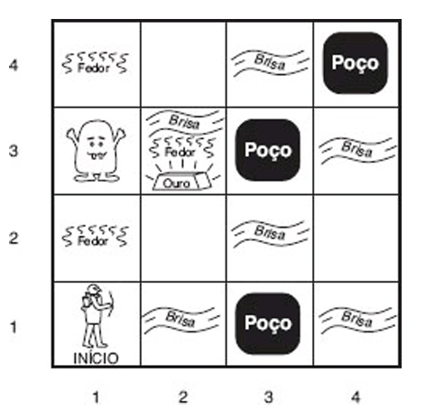

## Portifólio 4

# Agentes Lógicos

\vspace{10cm}

---

**Autor:** Wildemberg Sales da Silva Junior

**Matrícula:** 202017503

**Data:** 04/01/2025

**Instituição/Universidade:** Universidade de Brasília(UnB)

**Disciplina:** Inteligência Artificial - FGA0221

---

\newpage

## Resumo

Este artigo oferece uma visão abrangente sobre agentes baseados em conhecimento, explorando sua estrutura, funcionamento e os conceitos lógicos que o agente possui. A artigo aborda a estrutura de um agente baseado em conhecimento, suas operações TELL e ASK, além de demonstrar seu processo de resolução de problema com um exemplo de código. São explicadas as abordagens declarativa e procedural para construção desses agentes, e o ambiente de teste "Mundo de Wumpus" é apresentado para exemplificar os desafios de raciocínio e situações de incerteza em que o agente pode estar. O artigo também introduz conceitos de lógica, incluindo sintaxe, semântica e consequência lógica, e detalha a lógica proposicional com seus operadores. Por fim, um exemplo prático de um agente de diagnóstico médico, implementado em Python, demonstra o processo de inferência e reforça o potencial desses agentes em diversos setores.

## Visão Geral
O tema abordado neste artigo foi de extrema importância e valor, pois introduziu conceitos interessantes e valiosos sobre agentes inteligentes. Entender como um agente de IA pode aplicar lógica em problemas, abre um leque de conhecimento cada vez maior. Suas aplicações e como ele se aproxima de uma lógica humana, torna o assunto mais interessante, trazendo ideias e perpectivas novas para o conhecimento sobre IA.

\newpage

## Introdução
Neste artigo iremos abordar um novo modelo de agente inteligente, o **agente baseado em conhecimento**. Agentes baseados em conhecimento é o caso definido por Russel e Norvig, 2010, "em que projetamos agentes que podem formar representações de um mundo complexo, usar um processo de inferência para derivar novas representações sobre o mundo e utilizar essas novas representações para deduzir o que fazer".

Esses agentes são baseados em uma abordagem de pensamento humano, pois humanos utilizam representações internas de conhecimento para resolver problemas e tomar decisões, e quando aplicada à inteligência artificial(IA), temos a geração de um agente baseado em conhecimento.

No decorrer deste artigo iremos obter uma visão geral sobre a funcionalidade desses agentes, suas definições, os conceitos que formam a lógica e conhecimento, e os processos de inferência realizados por esses agentes.

## Agente baseado em conhecimento
Como dito anteriormente, agentes baseados em conhecimentos tendem a possuir uma abordagem aproximada do pensamento humano, onde a partir do seu conhecimento, ele toma uma série de decisões.

Esses agentes tem como seu principal componente a base de conhecimento(KB), essa base de conhecimento é composta por uma série de sentenças que são expressas em uma **linguagem de representação de conhecimento**, onde essa linguagem representa alguma afirmação sobre o mundo. As sentenças também podem ser chamadas de axiomas quando são tomadas como verdade sem serem derivadas de outras (RUSSEL; NORVIG, 2010).

Nas bases de conhecimento deve haver modos de criar novas setenças e consutá-las, essas operações são nomeadas como TELL(informe) e ASK(pergunte), essas operações podem envolver processos de inferência que é a derivação de novas setenças a partir de antigas. Quando o processo de inferência é aplicado, se deve sequir algums critérios, que é quando se faz uma pergunta a base de conhecimento, ela deve ser respondida com o que está na base de conhecimento.

A seguir no *código 1* podemos observar a implementação abstrata em um esboço de um agente baseado em conhecimento.

````text
 função AGENTE-KB(percepção) retorna uma ação
    persistente: KB, uma base de conhecimento
                t, um contador, inicialmente igual a 0, indicando tempo
    TELL(KB, CRIAR-SENTENÇA-DE-PERCEPÇÃO(percepção, t))
    ação ← ASK(KB CRIAR-CONSULTA-DE-AÇÃO(t))
    TELL(KB, CRIAR-SENTENÇA-DE-AÇÃO(ação, t))
    t ← t + 1
    retornar ação
 ````
<figcaption align="center"><b>Código 1</b>: Implementação de um agente baseado em conhecimento, Fonte: RUSSELL, Stuart; NORVIG, Peter. Inteligência Artificial: Uma Abordagem Moderna, 2010, p. 285, figura 7.1</figcaption>

Um agente baseado em conhecimento opera seguindo 3 etapas principais, onde a primeira é a de percepção, que é o momento em que ele percebe o ambiente em que está inserido e atualiza sua base de conhecimento, a segunda é a consulta, onde ele consulta sua base de conhecimento para decidir sua próxima ação no ambiente, e a terceira é a de execução, onde ele informa a base de conhecimento sua ação e a executa. Esses agentes independem de suas implementações específicas, eles focam no que sabem e nas suas metas, um exemplo que pode ser citado é de um ônibus automorizado, que sabe como navegar em uma cidade, com base nos conhecimentos que possui e nos conhecimentos retirados do ambiente.

Os agentes podem ser criados seguindo dois tipos de abordagem:

* **Abordagem declarativa:** Onde só são passadas informações para sua base de conhecimento e ele irá definir como agir baseado nessas informações, seguindo as regras que foram informadas;
* **Abordagem Procedural:** Neste modelo é passado para o usuário as regras e intruções de como agir em um ambiente, sem necessariamente informar a ele uma base de conhecimento;

## O mundo de Wumpus
O mundo de Wumpus é um ambiente de teste utilizado para media as capacidades de raciocínio e conhecimento de agentes KB. Esse modelo de forma mais geral, é uma grade 4x4 que representa uma caverna guardada pelo monstro Wumpus, essa caverna possui alguns poços espalhados por ela que se o agente cair em um deles, ele perde, no início o agente começa no canto inferior esquerdo, e tem o objetivo de coletar o máximo de ouro espalhado pela caverna e depois sair dela pelo mesmo lugar que entrou, enquanto evita os poços e o monstro Wumpus. O agente também pode matar o monstro Wumpus, basta ele usar uma flecha, mas isso dá um desconto de pontuação do agente. A seguir vamos entender com mais detalhes esse mapa, e também podemos ver um exemplo do mapa na *figura 1*:


<figcaption><b>Código 1</b>: Teste do mundo de Wumpus, Fonte: RUSSELL, Stuart; NORVIG, Peter. Inteligência Artificial: Uma Abordagem Moderna, 2010, p. 288, figura 7.2</figcaption>

* Descrição do Ambiente:
    * Uma caverna de 16 blocos (4x4), onde cada bloco pode conter ouro, poços ou o Wumpus;
    * A entrada e saída da caverna onde o agente começa fica no canto inferior esquerdo;

* Funcionamento do Ambiente:
    * O agente pode movimentar para a esquerda ou para a direita no ângulo de 90°;
    * O agente pode disparar flecha em linha reta somente, e só pode ser usada uma vez;
    * O agente pode sair da caverna mas apenas voltando para o bloco inicial;
    * O agente conta com alguns sensores:
        * Fedor: Onde ele percebe que o monstro esta nas salas adjacentes;
        * Brisa: Significa que existe um poço em uma sala adjacente;
        * Brilho: Siginifica que existe ouro na sala;
        * Impacto: Siginifica que ele chegou a um limite de deslocamento naquela direção (parede);
        * Grito: Significa que a flecha que o agente disparou matou o wumpus;

* Desafios do Ambiente:
    * O agente não consegue observar todo o ambiente em que está inserido, ele só enxerga localmante e usa inferências para as ações;
    * As ações do agente provocam as recompensas ou as penalidades, deste modo ele deve ficar lidando com a incerteza;
    * Sua ignorância inicial sobre o ambiente, onde o agente não sabe o que fazer no início da caverna;

* Regras das pontuações:
    * +1000 se sair da caverna com o outro;
    * -1000 se morrer na caverna, seja pelos poços ou pelo monstro;
    * -10 se disparar a flecha;
    * -1 por cada ação realizada;

Portanto, o agente deve trabalhar baseado nessas regras para cumprir seu objetivo e alcançar as suas metas, que no caso, o agente deve sair com o máximo de ouro da caverna.

## Lógica
Até o presente momento, exploramos o modelo de agente baseado em conhecimento de forma mais superficial, a partir de agora, iremos explorar algumas nuances desse modelo. Neste tópico iremos discutir sobre o que é lógica, seus conceitos e definições, e como isso se aplica a um agente.

Durante o período de 384 a.C. e 322 a.C., o filósofo grego Aristóteles criou o estudo da lógica, essa lógica em seu contexto seria uma série de restrições em que o conhecimento deveria passar para ser reconhecido como um conhecimento verdadeiro e universal. Se pensarmos na lógica que Aristóteles descreveu e trouxermos isso para o nosso contexto de agentes, vamos descobrir que os agentes baseados em conhecimentos se utilizam da lógica proposicional para realizar suas inferências a partir das sentenças contidas em sua base.

As senteças que fazem parte da base de conhecimento de um agente seguem uma sintaxe que impõe regras de formação para dar sentido a elas. Se pegarmos um exemplo de um cálculo simplem como "X+Y=4", essa fórmula faz sentido pois ela segue um padrão válido, mas se pergarmos um modelo como "X4Y = +", a fórmula já perde o sentido e se torna uma sentença inválida. Por isso é importante seguir a sintaxe ao fornecer conhecimento a um agente.

As sentenças também devem possuir semântica, que é o significa das sentenças em relação aos mundos possíveis, ou seja, os valores verdadeiros e falsos que cada sentença deve ter quando exposta a valores diferentes. Um exemplo é a fórmula "X+Y=4" ela é verdadeira quando X e Y são iguais a 2, mas é falsa quando X e Y são iguais a 1. Um fator importante é que as sentenças nunca serão 
diferentes de verdadeiro ou falso, pois não existe um valor intermediário que elas possam assumir.

Outro termo importante para ser discutido dentro de lógica é a **consequência lógica**, que nada mais é do que a afirmação de que se em um conjunto de A e B, se A for sempre verdadeiro, então B também será verdadeiro, logo, B é uma consequência de A. Com isso podemos afirmar que o conjunto de A está contido no conjunto de B, portanto, A é consequência de B, se e somente se A está contido em B.

Se observamos a fundo como os agentes KB trabalham em suas inferências, iremos perceber que eles se utilizam da **lógica proposicional** que é uma forma de representação do raciocínio lógico, essa lógica trabalha diretamente com as sentenças contidas na KB dos agentes e possui uma série de operadores lógicos, dentre eles estão: 

* Negação (NOT): Faz a inversão do valor de uma sentença, ou seja, se a sentença for verdadeira, ela se torna falsa, e se for falsa, ela se torna verdadeira;
* Conjunção (AND): Une duas sentenças e as avalia, se as duas forem verdadeiras, então o valor delas vai ser verdadeiro, se uma delas for falsa, o valor será falso; 
* Disjunção (OR): Na união das duas sentenças, basta somente uma ser verdadeira para que o valor resultante seja verdadeiro, caso contrário, será falso;
* Condicional: Uma sentença só será verdadeira, se a outra da união for verdadeira; 
* Bicondicional: O valor resultante só é verdadeiro quando as duas sentenças tem o mesmo valor;

Agora para sentenças complexas, existe uma variação desses operadores, se pegarmos duas sentenças X e Y, temos:

* NOT X é verdadeiro se e somente se X é falso;
* X AND Y é verdadeiro se e somente se X e Y forem verdadeiros;
* X OR Y é verdadeiro se e somente se X ou Y forem verdadeiros;
* X CONDIÇÃO(Y) é verdadeiro a menos que X seja verdadeiro e Q seja falso;
* X BICONDICIONAL Y é verdadeiro sse X e Y são ambos verdadeiros ou ambos falsos;

A seguir podemos ver na *tabela 1* o resumo das possíveis condições:

| X     | Y     | NOT X | X AND Y | X OR Y | X CONDIÇÃO Y | X BICONDICIONAL Y |
|-------|-------|-------|---------|--------|--------------|--------------------|
| True  | True  | False | True    | True   | True         | True               |
| True  | False | False | False   | True   | False        | False              |
| False | True  | True  | False   | True   | True         | False              |
| False | False | True  | False   | False  | True         | True               |
<figcaption><b>Tabela 1</b>: Possíveis condições para as operações lógicas em sentenças complexas</figcaption>

## Processo de inferência
Para entermos o processo de inferência realizado por um agente, podemos analisar o seguinte exemplo:

Um agente aplicado na área médica, deve auxiliar os médicos no diagnóstico de doenças utilizando um conjunto de regras baseadas em sintomas, neste modelo de agentes iremos trabalhar na abordagem declarativa:

* Estado do paciente:
    * Está com febre;
    * Está com tosse seca;
    * Está com dificuldade em respirar;

* Regras (Sentenças):
    * Se o paciente está com febre e tem tosse seca, então o paciente pode ter uma infecção viral;
    * Se o paciente tem dificuldade para respirar e febre, então o paciente pode ter pneumonia;
    * Se o paciente pode ter uma infecção viral e dificuldade para respirar, então o paciente deve ser avaliado para COVID.

* Processo de inferência:
    * O agente recebe os dados do paciente, e analisa os sintomas;
    * O agente verifica as regras e aplica aos sintomas;
    * Todas as sentenças dão resultado verdadeiro;
    * Ele constata que o paciente está com pneumonia, infecção viral, e deve ser avaliado para a COVID;

Se aplicarmos o exemplo a um código em python, iremos ter a aplicação de um agente baseado em lógica proposicional. No *código 2* é possível ver a aplicação desse agente em python:

````python
class AgenteBaseadoEmConhecimento:
    def __init__(self):
        # Fatos conhecidos sobre o paciente
        self.febre = False
        self.tosse_seca = False
        self.dificuldade_respirar = False
        
        # Diagnósticos possíveis
        self.infeccao_viral = False
        self.pneumonia = False
        self.avaliacao_covid = False
        
    def receber_fatos(self, febre, tosse_seca, dificuldade_respirar):
        # Atribuindo os fatos conhecidos
        self.febre = febre
        self.tosse_seca = tosse_seca
        self.dificuldade_respirar = dificuldade_respirar
        
    def aplicar_regras(self):
        # Aplicando as regras de inferência

        # Regra 1: Se o paciente está com febre e tem tosse seca, pode ter uma infecção viral
        if self.febre and self.tosse_seca:
            self.infeccao_viral = True

        # Regra 2: Se o paciente tem dificuldade para respirar e febre, pode ter pneumonia
        if self.febre and self.dificuldade_respirar:
            self.pneumonia = True

        # Regra 3: Se o paciente tem infecção viral e dificuldade para respirar, deve ser avaliado para COVID-19
        if self.infeccao_viral and self.dificuldade_respirar:
            self.avaliacao_covid = True

    def diagnostico(self):
        # Exibindo o diagnóstico com base nas conclusões
        if self.infeccao_viral:
            print("Diagnóstico: O paciente pode ter uma infecção viral.")
        if self.pneumonia:
            print("Diagnóstico: O paciente pode ter pneumonia.")
        if self.avaliacao_covid:
            print("Diagnóstico: O paciente deve ser avaliado para COVID-19.")
        if not (self.infeccao_viral or self.pneumonia or self.avaliacao_covid):
            print("Diagnóstico: Não foi possível determinar um diagnóstico com base nos dados fornecidos.")

# Criando o agente
agente = AgenteBaseadoEmConhecimento()

# Definindo os fatos para o paciente (febre, tosse seca, dificuldade para respirar)
agente.receber_fatos(febre=True, tosse_seca=True, dificuldade_respirar=True)

# Aplicando as regras para obter o diagnóstico
agente.aplicar_regras()

# Exibindo o diagnóstico final
agente.diagnostico()
````
<figcaption align="center"><b>Código 2</b>: Implementação em python do exemplo do agente de diagnóstico de doenças, Fonte: OPENAI. Assistente Virtual ChatGPT, 2024</figcaption>

## Conclusão
Portanto, baseado em tudo que foi estudado e explorado neste artigo, foi possível obter uma visão abrangente sobre o funcionamento de agentes baseados em conhecimento e como eles funcionam, além de explorarmos exemplos de atuações desse agente, também conseguimos explorar o que é lógica, e o modelo de lógica que esses agentes utilizam.   
Portanto, podemos concluir que agentes baseados em conhecimento são muito flexíveis e podem atuar em diversos ambientes utilizando a lógica e a inferência para se chegar à suas metas. Diversas setores podem utilizar estes tipos de agentes para otimizar os processos, podemos afirmar isso baseado nos exemplos mostrados, como o ônibus automotorizado e o agente de diagnóstico médico.

## Referências

> [1] RUSSELL, Stuart; NORVIG, Peter. *Inteligência Artificial: Uma Abordagem Moderna* – 3ª edição.  
> [2] OPENAI. Assistente Virtual ChatGPT. Respostas geradas com base em inteligência artificial. Disponível em: https://openai.com. Acesso em: 04 dez. 2024.  